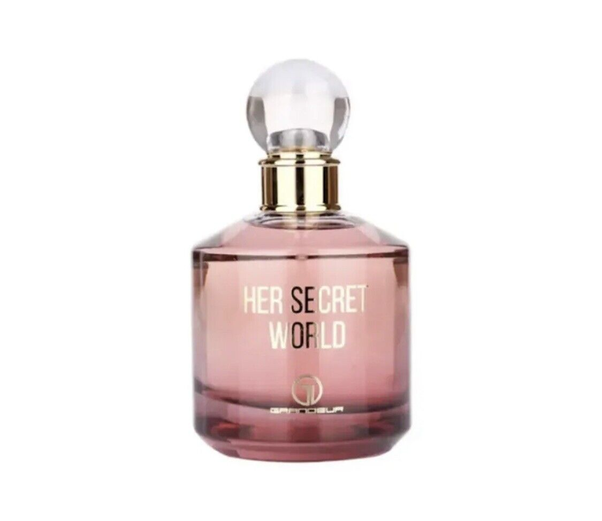
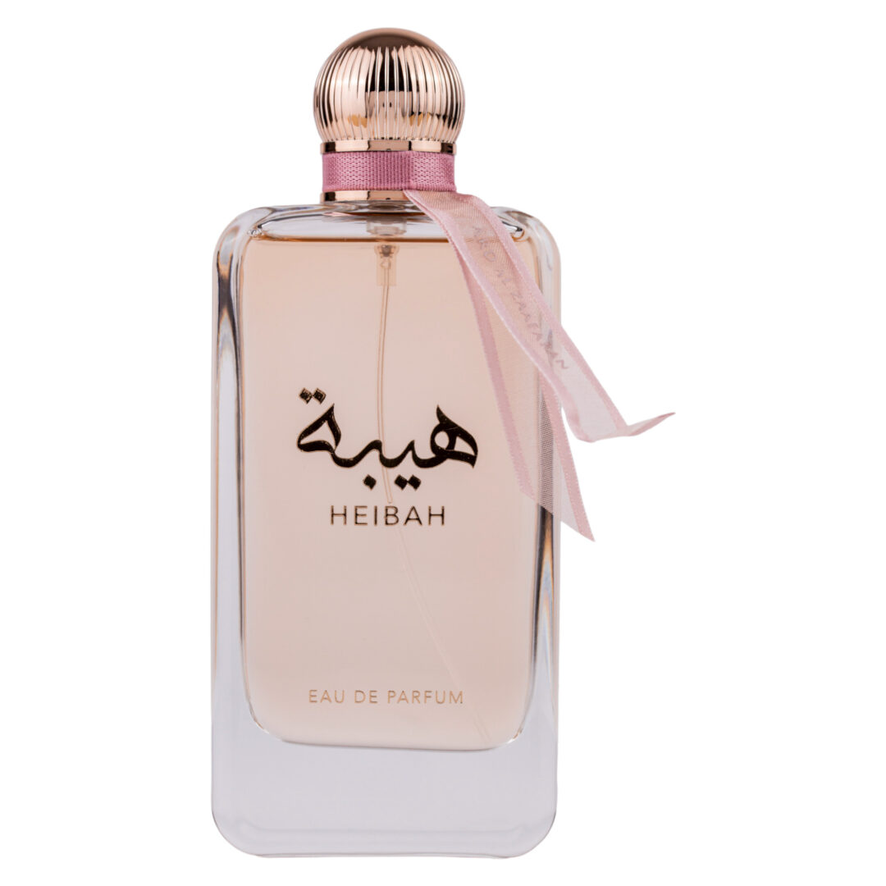
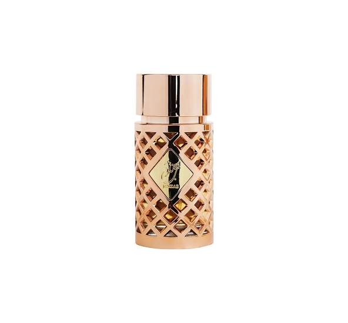
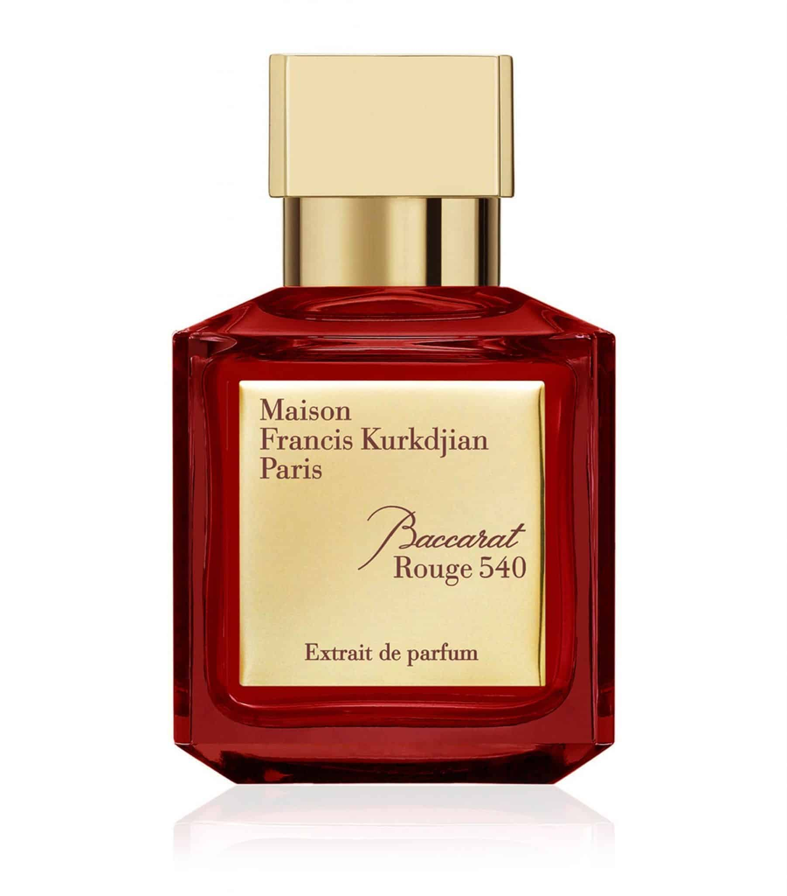

```{r setup, include=FALSE}
knitr::opts_chunk$set(echo = FALSE)
```

{width=30%}
Her Secret World is a perfume produced for females, it is a soft sweet floral fragrant.  This product is made from Orange Blossom, Vanilla, Iris, Jasmine, Bitter Orange, Amber,  Peach, Pink Pepper, Rose, Tuberose.


{width=30%}
Heibah is a perfume specially made for women, it consumes of  Lemon, Mandarin Orange,   Bulgarian Rose, Tuberose, Jasmine, Sandalwood, Caramel, Musk, Cashmere Wood, Cinnamon, Patchouli and  Amber.


{width=30%}
Jazzab Gold is ladies perfume, the ingredients are:  alcohol denat, water, benzyl salicylate,benzyl alcohol, coumarin, geraniol, citronellol, citral.


{width=30%}
Baccarat Rough 540  is a unisex perfume, it contains of, egyptian jasmine, bitter almond, grey amber, and woody musk.

{width=30%}
